# Vault Investment – Portfolio & Risk Analysis and Optimization Tool

## Overview

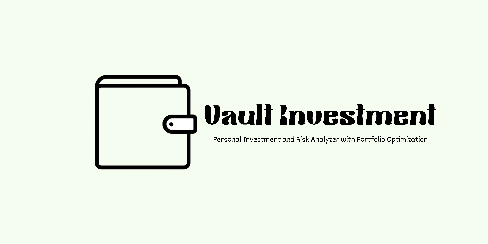

Vault Investment is a comprehensive web application built with Streamlit, designed to empower investors with tools for portfolio tracking, optimization, and risk analysis.

It allows users to:

- Upload transaction data from various brokerages
- Analyze portfolio performance
- Optimize asset allocation
- Assess potential risks

The application provides a **user-friendly interface** with detailed visualizations and actionable insights.

---

## Key Features

- **Data Import:** Supports CSV uploads from Robinhood, Fidelity, Charles Schwab, Vanguard, and generic formats. Handles various formats with robust parsing logic.
- **Portfolio Tracking:** Calculates portfolio value, sankey charts, gain/loss, asset allocation, and performance metrics.
- **Portfolio Optimization:** Uses Modern Portfolio Theory for strategies like:
  - Maximum Sharpe Ratio
  - Minimum Volatility
  - Maximum Return
- **Risk Analysis:** Provides metrics such as:
  - Volatility
  - Value at Risk (VaR)
  - Sharpe Ratio
  - Maximum Drawdown
  - Beta  
    Includes risk-return scatter plots, volatility charts, and drawdown analysis.
- **Advanced Analysis:** Monte Carlo simulations, efficient frontier, and conditional beta analysis.
- **Historical Data Integration:** Uses `yfinance` for accurate price history.
- **Comprehensive Reporting:** Download portfolio and optimization results.
- **Customizable Parameters:** Adjustable risk-free rate, data period, and max allocation.
- **Data Validation:** Built-in checks and error handling.
- **Clear Documentation:** Well-commented code and detailed README.

## Screenshots

Below are key screenshots showcasing various features of the Vault Investment app.

- Portfolio Tracking:
<p align="center">
  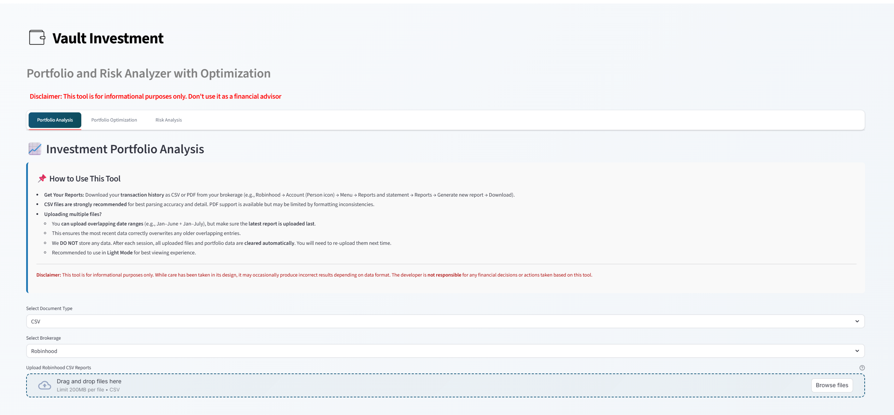
</p>
<p align="center"><em>Uploading investment data from CSV files</em></p>

<p align="center">
  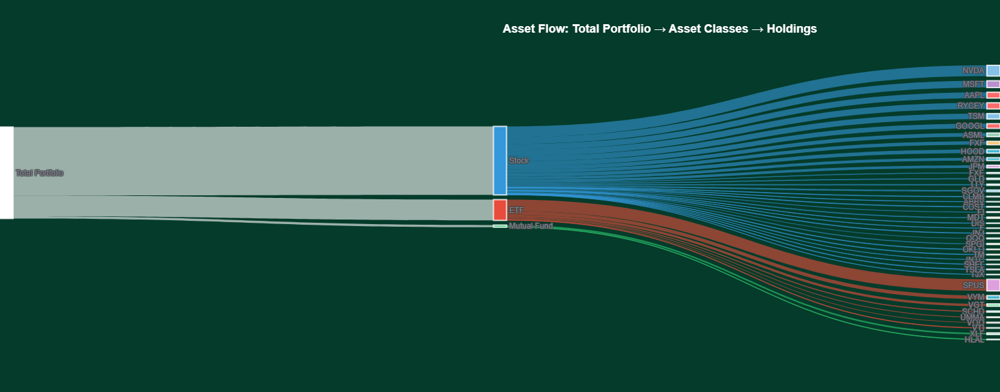
</p>
<p align="center"><em>Interactive Sankey chart illustrating portfolio asset allocation flow</em></p>

<p align="center">
  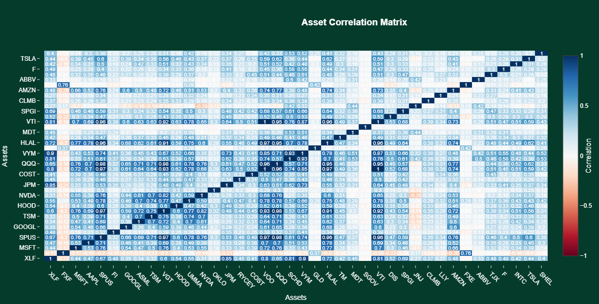
</p>
<p align="center"><em>Portfolio asset correlations</em></p>

- Portfolio Optimization:
<p align="center">
  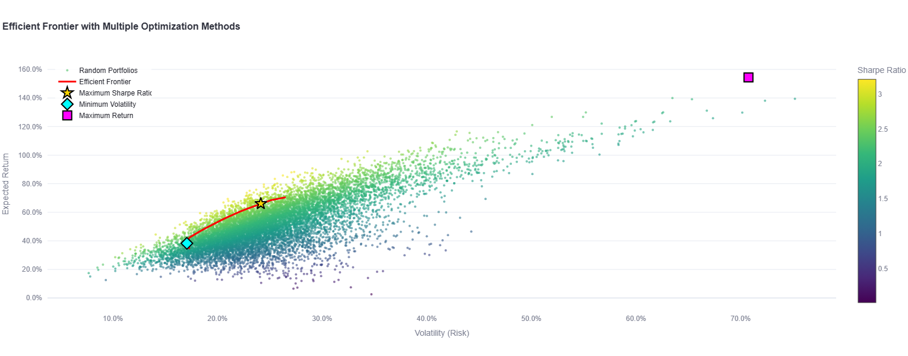
</p>
<p align="center"><em>Efficient Frontier visualization showing optimal risk-return trade-offs</em></p>

<p align="center">
  
</p>
<p align="center"><em>Monte carlo simulation</em></p>

<p align="center">
  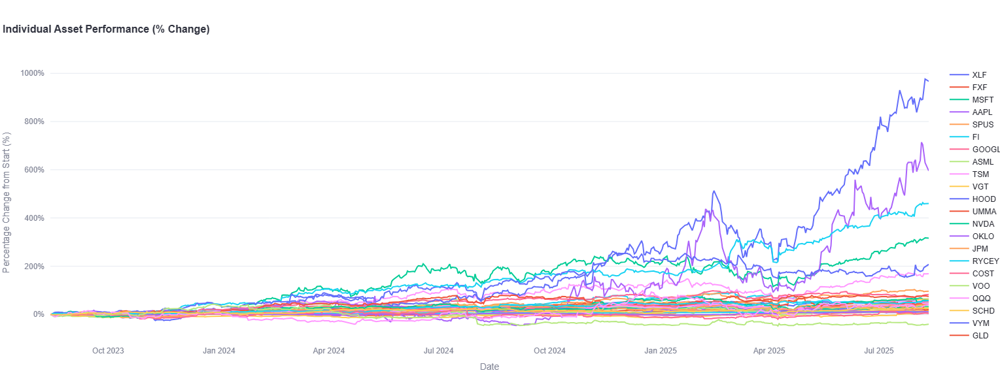
</p>
<p align="center"><em>Performance metrics of individual assets over the selected period</em></p>

<p align="center">
  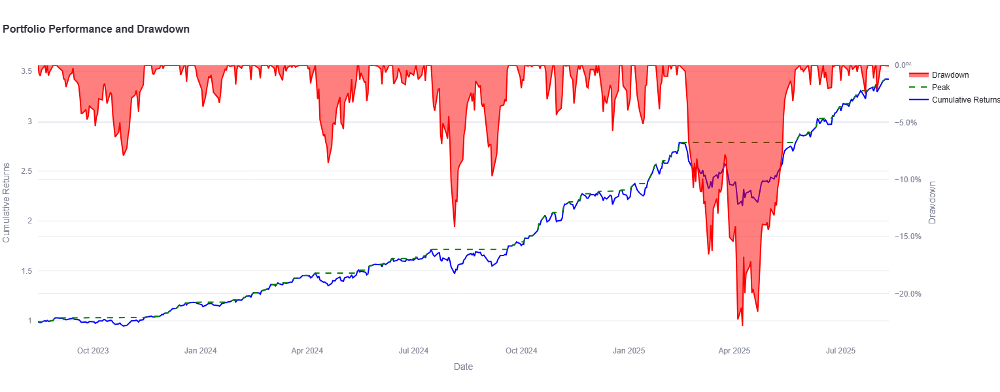
</p>
<p align="center"><em>Overall portfolio performance and Drawdown analysis</em></p>

- Portfolio Risk Analysis:

<p align="center">
  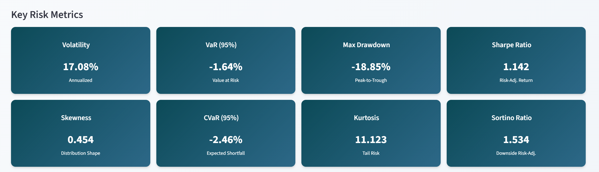
</p>
<p align="center"><em>Key risk metrics dashboard including volatility, VaR, drawdown, etc</em></p>

<p align="center">
  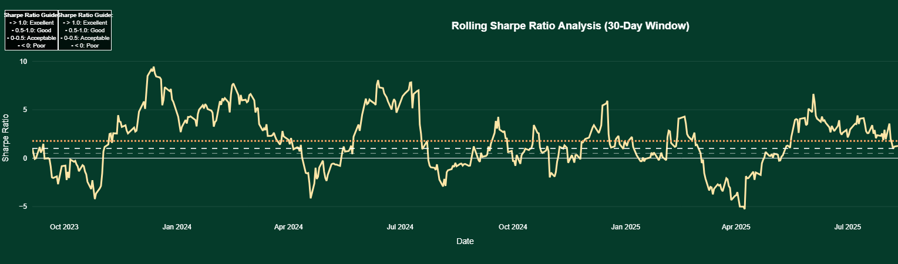
</p>
<p align="center"><em>Rolling Sharpe Ratio chart demonstrating risk-adjusted returns over time</em></p>

<p align="center">
  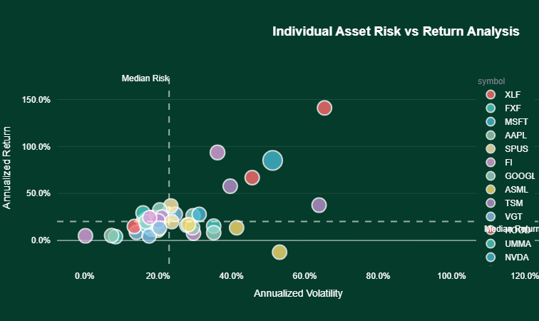
</p>
<p align="center"><em>Risk vs. return scatter plot for portfolio assets</em></p>

<p align="center">
  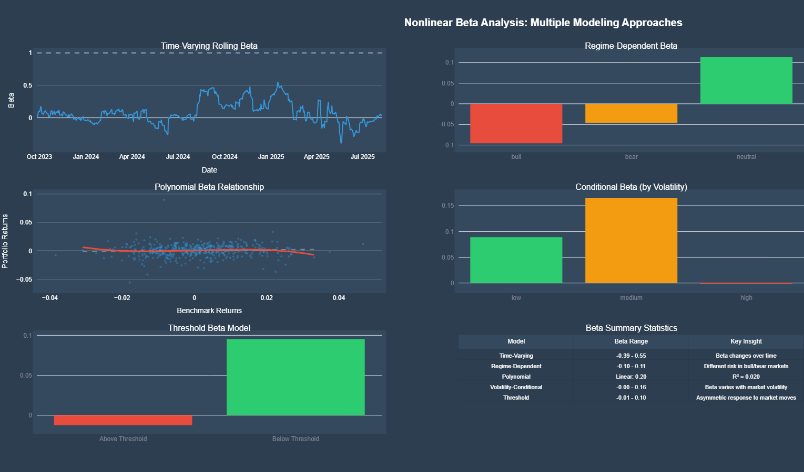
</p>
<p align="center"><em>Advanced non-linear beta analysis of portfolio sensitivity</em></p>
<p align="center">
  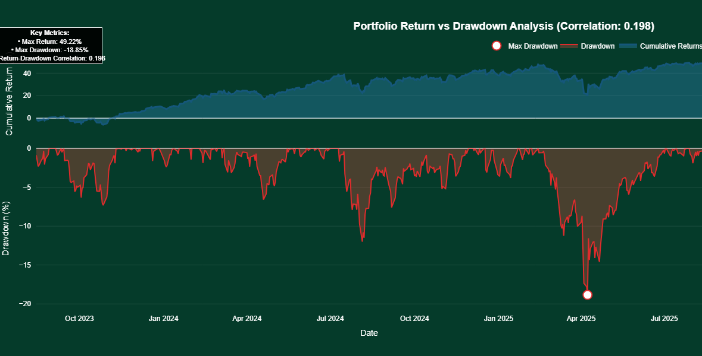
</p>
<p align="center"><em>Risk vs. drawdown plot for portfolio assets</em></p>

---

## Technologies Used

- **Python** – Core programming language
- **Streamlit** – Interactive web app framework
- **Pandas** – Data manipulation
- **NumPy** – Numerical computing
- **yfinance** – Financial data fetching
- **SciPy** – Optimization/statistics
- **scikit-learn** – Machine learning (PCA, KMeans)
- **pdfplumber** _(optional)_ – PDF parsing
- **fuzzywuzzy** – Fuzzy string matching

---

## Project Structure

```plaintext
Vault Investment/
├── app.py                       # Main Streamlit app
├── core/                        # Core logic & data processing
│   ├── data_fetcher.py          # Fetches Yahoo Finance data
│   ├── robinhood_parser.py      # Parses Robinhood CSV/PDF
│   └── portfolio_optimizer.py   # Optimization algorithms
├── interfaces/                  # UI components
│   ├── investment_tracker.py    # Portfolio tracking UI
│   ├── portfolio_optimizer_interface.py  # Optimization UI
│   └── risk_analysis_interface.py        # Risk analysis UI
├── utils/                       # Utilities & visualizations
│   ├── risk_analysis.py         # Risk metrics & charts
│   ├── risk_beta_analysis.py    # Advanced beta analysis
│   ├── portfolio_charts.py      # Chart rendering
│   ├── theme.py                 # Custom Streamlit theme
|   └── other visualizations...
├── helpers.py                   # Data processing helpers
├── requirements.txt             # Dependencies
└── README.md                    # Documentation
```

---

## Installation

### 1️⃣ Clone the repository

```bash
git clone https://github.com/abtonmoy/vault-Investment.git
cd Vault-Investment
```

### 2️⃣ Create a virtual environment (recommended)

```bash
python -m venv venv
# On Linux/macOS
source venv/bin/activate
# On Windows
venv\Scripts\activate
```

### 3️⃣ Install dependencies

```bash
pip install -r requirements.txt
```

---

## Running the Application

Activate the virtual environment (if created) and run:

```bash
streamlit run app.py
```

This will open the app in your browser.

---

## Usage

1. **Upload investment data**
   Go to **"Investment Portfolio"** tab and upload your CSV transaction history.
2. **Analyze portfolio**
   View holdings, performance metrics, and asset allocation.
3. **Optimize portfolio**
   Choose a strategy in **"Portfolio Optimization"** and run the optimization.
4. **Assess risk**
   Explore risk metrics and visualizations in the **"Risk Analysis"** tab.

---

## Contributing

Contributions are welcome!

**Guidelines:**

1. Fork the repository
2. Create a new branch
3. Make changes with descriptive commit messages
4. Submit a pull request

---

## License

This project is licensed under the **MIT License**.

---

## Disclaimer

This tool is for **informational purposes only**. While designed with care, it may produce incorrect results depending on data format. The developer is **not responsible** for any financial decisions made using this tool.

---

## Future Enhancements

- Improved PDF parsing
- API integration with brokerages
- Backtesting for investment strategies
- Tax reporting assistance
- User authentication & data storage
- Advanced optimization algorithms
- Customizable risk metrics
- Alerts for major portfolio changes
- Interactive charts (zoom, pan, explore)
- More robust error handling
- Expanded documentation
- Automated testing
- Cloud deployment (Heroku, AWS, Azure)

## 📧 Developer Contact

[Abdul Basit Tonmoy](abdulbasittonmoy@gmail.com)
GitHub Repo: [https://github.com/abtonmoy/vault-Investment](https://github.com/abtonmoy/vault-Investment)
